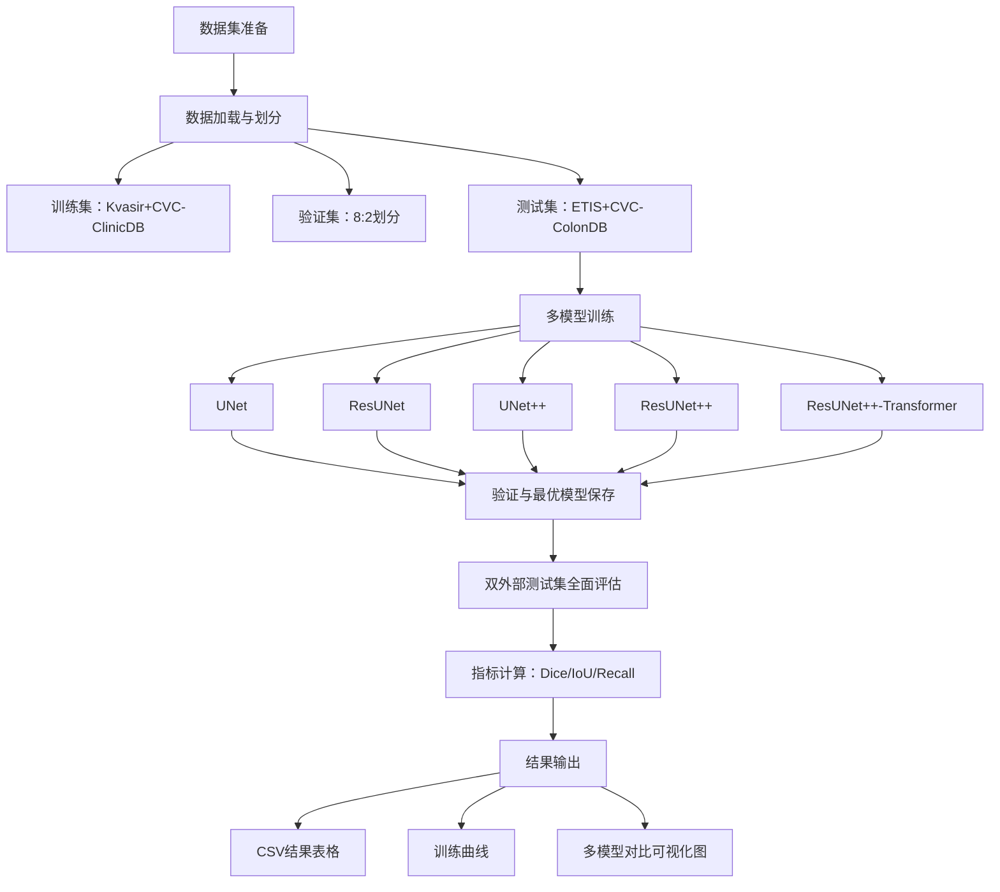
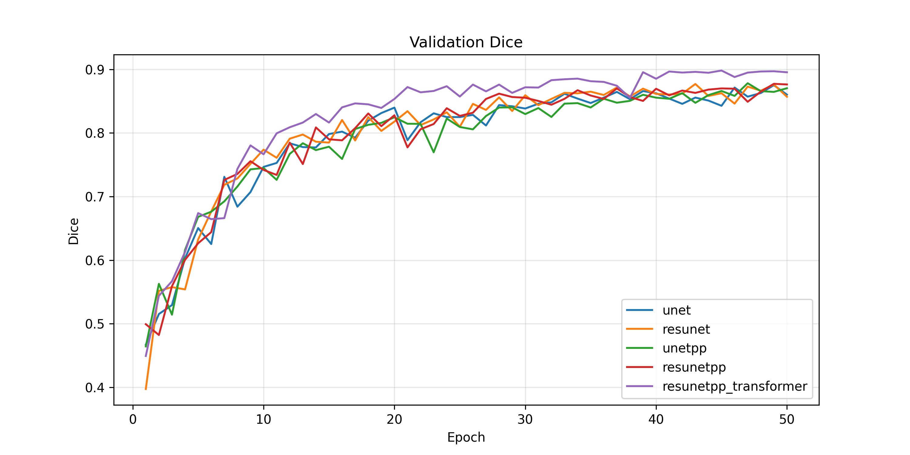
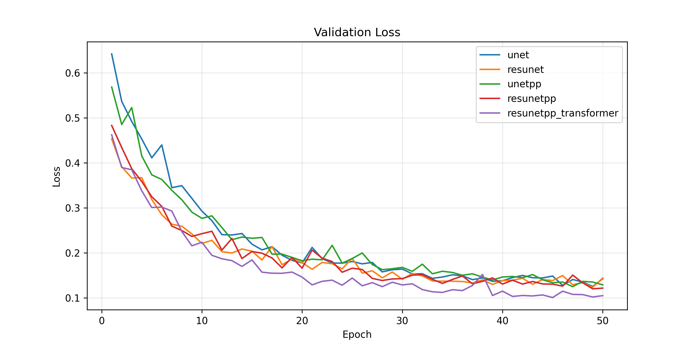
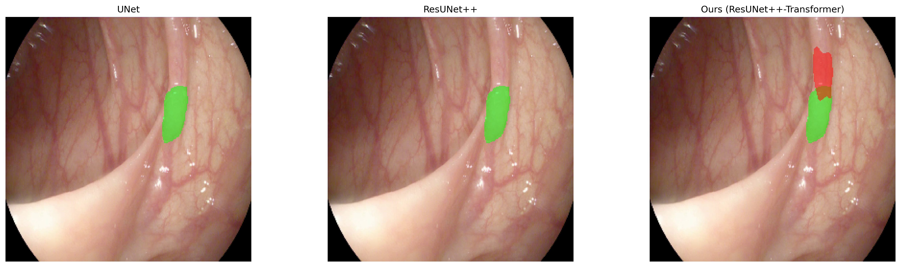

# 医学内镜图像息肉分割系统
# Medical Endoscopic Image Polyp Segmentation System
A research-oriented project for polyp segmentation in endoscopic images, using classic segmentation models, residual-enhanced structures, and Transformer-based global modeling to achieve accurate polyp detection and segmentation.

The project builds a comprehensive experimental benchmark including:
- Basic segmentation model (UNet)
- Residual-enhanced models (ResUNet, ResUNet++)
- Transformer-integrated improved model (ResUNet++-Transformer)
- Deep supervision and lightweight optimization strategies

The goal is to analyze how different model structures and training strategies affect the accuracy and robustness of polyp segmentation in clinical endoscopic images.

### 本项目面向临床肠镜息肉自动检测任务，构建一套完整的医学图像分割实验框架，基于UNet、ResUNet、UNet++、ResUNet++ 及改进的Transformer混合模型进行多结构对比，实现息肉区域精准分割，并提供全面的模型评估、结果可视化与数据分析。
---

## 项目简介
结肠息肉是结直肠癌的重要前期病变，内镜下息肉分割对早期诊断与手术规划具有重要临床价值。
本项目以**医学内镜息肉分割**为研究目标，构建了一套从数据加载、模型训练、多模型对比、双外测试集验证到结果可视化的完整科研 pipeline。

项目核心亮点：
- 多模型公平对比：UNet / ResUNet / UNet++ / ResUNet++ / ResUNet++-Transformer统一训练评估
- 医学分割专用结构：残差连接、UNet++密集跳跃连接、瓶颈Transformer全局建模
- 深度监督训练：加速收敛、提升小目标息肉分割精度
- 双独立外部测试集：ETIS-LaribPolypDB、CVC-ColonDB，验证模型泛化能力

---

## 项目流程图


---

## 快速开始

### 1. 仓库克隆
```bash
# 克隆GitHub仓库
git clone https://github.com/Chen-daydayup/medical_segmentation_final_final.git

# 进入项目目录
cd medical_segmentation_final_final
```

### 2. 环境准备
```bash
# 安装依赖
pip install -r requirements.txt
```

### 3. 配置与数据集
将数据集按如下结构放入`data/`目录：
```
data/
├── Kvasir/
│   ├── images/
│   └── masks/
├── CVC-ClinicDB_PNG_datasets/             #均同上
├── ETIS-LaribPolypDB/
└── CVC-ColonDB/
```

在`config.py`中确认路径、超参数、训练设置。

### 4. 运行训练与评估
```bash
python main.py
```

### 5. 生成模型对比可视化图
```bash
python visualize.py
```

所有结果自动保存至 `results/` 目录，具体生成内容如下：
### 生成结果与可视化说明
1.  模型权重文件：保存5个模型训练过程中验证集Dice最高的最优权重。
2.  结果表格：
    - `train_results.csv`：记录各模型参数量、验证集最优Dice、验证集最优IoU，便于对比模型拟合能力。
    - `final_test_results.csv`：记录各模型在ETIS-LaribPolypDB、CVC-ColonDB两个外部测试集上的Dice、IoU、Recall指标，用于评估模型泛化能力。
3.  训练曲线：
    - 生成验证损失曲线和验证Dice曲线直观展示各模型训练收敛过程、稳定性及性能差异。
4.  可视化对比图：
    - 存放ETIS-LaribPolypDB测试集和CVC-ColonDB测试集上3个模型（UNet、ResUNet++和ResUNet++-Transformer）的分割对比图，各20张。
    - 每张对比图包含原图、真实标签（GT）、各模型预测结果。

---

## 支持的模型与方法

| 模型类别 | 具体实现 |
|---------|---------|
| 基础分割模型 | UNet |
| 残差增强模型 | ResUNet |
| 密集连接模型 | UNet++ |
| 高级分割模型 | ResUNet++ |
| 本文改进模型 | ResUNet++-Transformer（瓶颈Transformer+深度监督） |
| 损失函数 | Dice-BCE混合损失 |
| 优化器 | AdamW |
| 评估指标 | Dice、IoU、Recall |
| 训练策略 | 固定随机种子、验证集最优保存、深度监督训练 |

---

## 项目结构
```
medical_segmentation_final/
├── data/                     # 数据集与数据加载模块
│   ├── dataset.py            # 通用分割数据集类
│   └── 各类息肉数据集文件夹（须自行下载）
├── models/                   # 模型定义模块
│   ├── unet.py
│   ├── resunet.py
│   ├── unetpp.py
│   ├── resunetpp.py
│   ├── resunetpp_transformer.py
│   └── __init__.py           # 模型统一导出
├── losses/                   # 损失函数模块
│   ├── loss_factory.py       # DiceBCELoss
│   └── __init__.py
├── train/                    # 训练模块
│   ├── trainer.py            # 训练/验证函数
│   └── __init__.py
├── utils/                    # 工具函数模块
│   ├── metrics.py            # Dice、IoU计算
│   ├── table_generator.py    # 结果表格生成
│   ├── visualization.py      # 可视化工具
│   └── __init__.py
├── results/                  # 自动生成结果目录
│   ├── weights/              # 模型权重.pth
│   ├── curves/               # 训练曲线图
│   ├── figures/              # 可视化对比图
│   ├── train_results.csv
│   └── final_test_results.csv
├── config.py                 # 全局配置文件
├── main.py                   # 训练、评估、测试主入口
├── visualize.py              # 多模型对比绘图脚本
├── requirements.txt
└── README.md
```

---

## 实验结果分析

### 1. 模型参数量与验证集性能
| 模型 | 参数量 (M) | 验证集 Dice | 验证集 IoU |
|------|------------|-------------|------------|
| UNet | 4.90 | 0.8680 | 0.7928 |
| ResUNet | 5.14 | 0.8807 | 0.8074 |
| UNet++ | 6.21 | 0.8718 | 0.7966 |
| ResUNet++ | 6.57 | 0.8774 | 0.8040 |
| **ResUNet++-Transformer** | 8.28 | **0.9004** | **0.8342** |

> 结论：在参数量合理增加的前提下，本文提出的ResUNet++-Transformer 模型在验证集上取得了最高的Dice和IoU，证明了其优越的拟合能力与收敛性能。

### 2. 双外部测试集泛化性能
#### ETIS-LaribPolypDB 测试集
| 模型 | Dice | IoU | Recall |
|------|------|-----|--------|
| UNet | 0.4298 | 0.3702 | 0.4532 |
| ResUNet | 0.4494 | 0.3930 | 0.4922 |
| UNet++ | 0.4380 | 0.3773 | 0.4832 |
| ResUNet++ | 0.3877 | 0.3357 | 0.4190 |
| **ResUNet++-Transformer** | **0.5365** | **0.4633** | **0.6806** |

#### CVC-ColonDB 测试集
| 模型 | Dice | IoU | Recall |
|------|------|-----|--------|
| UNet | 0.6423 | 0.5560 | 0.6743 |
| ResUNet | 0.6215 | 0.5357 | 0.6567 |
| UNet++ | 0.6359 | 0.5514 | 0.6490 |
| ResUNet++ | 0.5872 | 0.5126 | 0.5991 |
| **ResUNet++-Transformer** | **0.7032** | **0.6216** | **0.7296** |

> 结论：在两个完全独立的外部测试集上，本文模型均显著优于对比方法，展现了极强的泛化能力与鲁棒性，尤其在小目标息肉检测（高Recall）上优势明显。

### 3. 训练曲线
训练过程中，所有模型均保持稳定收敛，其中本文提出的ResUNet++-Transformer模型收敛速度最快、最终性能最优，具体训练曲线如下：
#### 训练曲线示例



### 4. 分割对比图示例
为直观展示各模型的分割效果，选取ETIS-LaribPolypDB测试集典型样本，对比UNet、ResUNet++与ResUNet++-Transformer三种模型的分割结果，如下所示：



---

## 核心创新点与结论
1.  **瓶颈 Transformer 增强全局建模能力**
    在 ResUNet++ 的瓶颈层引入多头自注意力机制，有效解决了CNN模型对息肉全局结构理解不足的问题，显著提升了小目标分割精度。

2.  **深度监督训练策略**
    采用多输出深度监督，让模型在不同层级都能获得梯度信号，不仅加快了收敛速度，还提升了模型对边缘细节的学习能力。

3.  **轻量化与高效性平衡**
    通过精简通道数与移除不稳定的注意力门控模块，模型在参数量可控的前提下实现了性能的显著提升，更适合医疗小样本数据集。

4.  **跨数据集泛化能力验证**
    在两个独立的外部测试集上，本文模型均取得最优性能，证明了其良好的泛化能力与临床应用潜力。

---

## 数据集说明
本项目使用四大公开息肉分割数据集（须自行下载）：
- Kvasir
- CVC-ClinicDB
- ETIS-LaribPolypDB
- CVC-ColonDB

所有数据集仅用于非商业科研与学习用途，版权归原作者所有。

---

## 依赖环境
```
torch>=2.0.0
torchvision>=0.15.0
albumentations>=1.3.0
opencv-python>=4.7.0
pillow>=9.0.0
numpy>=1.24.0
pandas>=2.0.0
scikit-learn>=1.2.0
tqdm>=4.65.0
matplotlib>=3.7.0
```

---

## 作者与说明

作者：陈勇


本项目为**医学图像分割科研实践项目**，面向肠镜息肉智能检测任务，提供完整、可复现、可直接用于论文实验的代码框架。


仅用于学习、科研与教学展示，禁止用于商业用途。如有问题或改进建议，欢迎交流。
